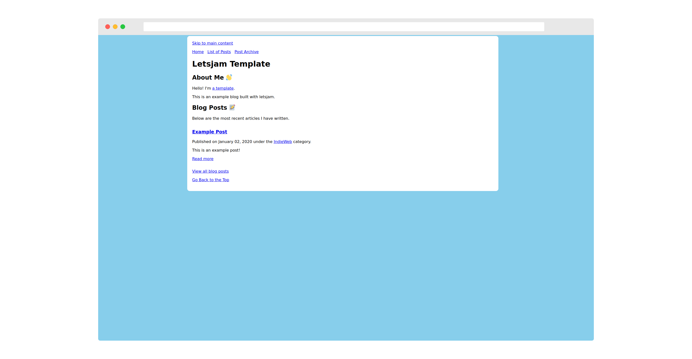
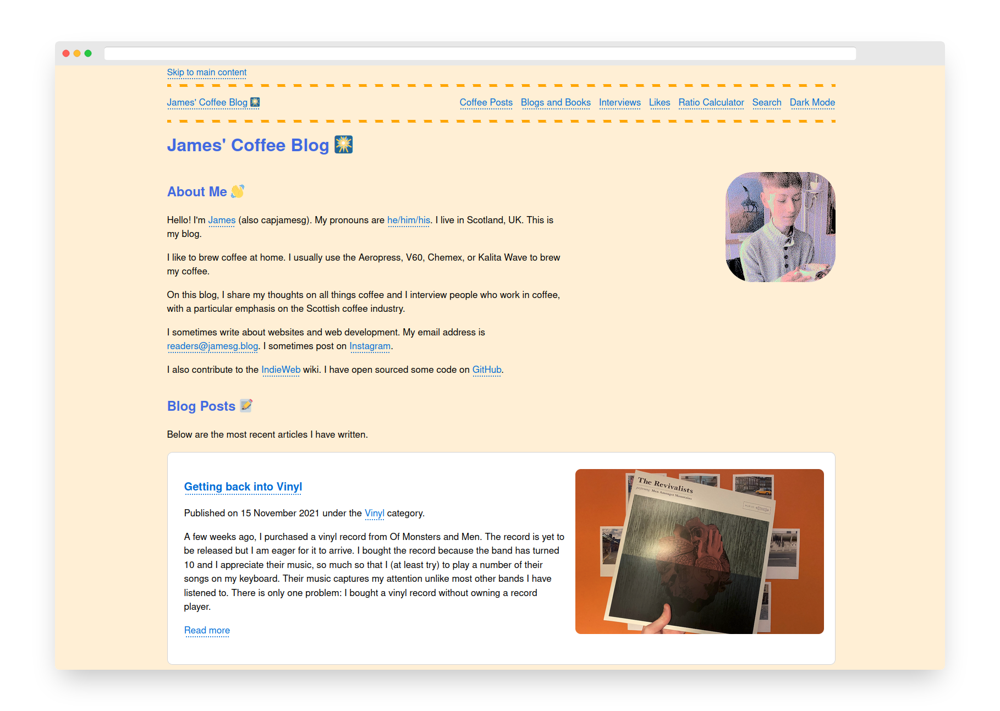

# letsjam

letsjam is a static site generator built with Python and jinja2.

letsjam is the generator behind my personal website, [jamesg.blog](https://jamesg.blog).

*This project is under active construction. There may be bugs present that are yet to be fixed.*

## Features

letsjam can:

- Build static pages from jinja2 templates.
- Create date archive pages formatted as /YYYY/MM/DD/
- Create paginated pages for each category you use on your blog (i.e. /category/coffee/2/)
- Create pages for groups of posts
- Use @ shortcuts to mention someone in a post

An example blog has been included with this project so you can get started quickly and have a reference point for key features.

Here is a screenshot of the example blog:

## Setup

First, install the required dependencies for this project:

    pip3 install -r requirements.txt

Once you have installed the required dependencies, you can run the project.

Place all of the files you want to include in your site in the same folder as your app.py file.

There are a few special folder names that are reserved for the static generator:

- assets/: A place to put any static files you have (i.e. images, CSS, JS).
- _posts/: A folder for all of your blog posts.
- _drafts/: A folder for your written drafts.

You must create a `config.yml` file in the same folder as your app.py file before running the site generator. An example of this file can be seen in the `config.yml` file in this project.

Accepted values are:

- title: The title of your site.
- description: A short description of your site.
- baseurl: The URL of your site.
- base_dir: The directory where your app.py file is stored.
- output: Where you want your static files to be saved.
- groups: A list of group pages you want to make. I use this to create my /likes/ pages, for example. All files in _likes/ are generated and then a /likes/ directory is created which houses all of my likes and pagination pages so the likes can be viewed.
- autogenerate:
    - category: Create category pages.
    - pagination: Create pagination pages.
    - date_archive: Create date archive pages.
    - list_page: Create list pages for groups (i.e. my "/likes/" example from earlier.)

Once you have your config.yml file ready to go, you can run the static site generator.

To run the static site generator, use this command:

    python3 app.py

All files generated are placed in a _site directory. This directory is purged on each generation.

### Folder Definitions

The example application has been set up to use the following folder structure:

- assets/: Any static assets (i.e. CSS, JS, images).
- _posts/: All of your blog posts.
- _drafts/: Your written drafts.
- _layouts/: Page layouts.
- _includes/: Resources to include in a web page.
- templates/: Web page templates.

The default project comes with five pages:

- A sitemap.xml file
- An index.html home page
- A 404 page
- An archive page
- A page with a list of articles

### letsjam Server

During development, you may want to host the site locally on a server so you can easily explore your site.

This project comes with a barebones Flask server that you can use for development. You can use the server by running this command:

    python3 server.py

The server is not built for production use. Please do not use the server in production.

## An Example File

A letsjam file should consist of either plain HTML or front matter followed by HTML or markdown.

Here is an example file that you could use in your generator:

    ---
    layout: default
    title: Social
    description: Links to all of the social posts on this website.
    ---

    <h1>Likes ❤️</h1>

    
Likes are posts where I share web pages I have liked reading or looking at.

This will create a file using the "default" layout.

Any item in the front matter will be available in the template as a variable, accessible through .page.

This syntax is designed to be similar to Jekyll, a popular static site generator. This is because all of my templates were written in Jekyll and I wanted to preserve the variable and formatting structure.

### jinja2 and Jekyll Front Matter Distinction

Please note this project is not compatible with every Jekyll file. You will need to use jinja2 markup rather than Liquid markup if you want to introduce logic to yuor pages. While both syntaxes share some features, a large portion of Liquid syntax (i.e. date formatting, string manipulation) and Jekyll syntax (i.e. limits and reverse sorting) is not supported natively by jinja2.

### At Mentions (@ mentions)

letsjam provides native support for @ mentions in accordance with IndieWeb [person tag](https://indieweb.org/person) best practices. You can use the following syntax to mention a URL in a blog post:

    @jamesg.blog

This will create a mention for jamesg.blog. This means, by default:

1. A link will be created to jamesg.blog with the anchor text jamesg.blog inline.
2. A new section will be added to the bottom of the blog post in which you mention any URL that lists all of the people mentioned in the post.

Optionally, you can add your own anchor text and image for each mention in a post.

You can do this by adding an entry to the person_tags.json file like so:

    {
        "jamesg.blog": {
            "full_name": "James' Coffee Blog",
            "url": "https://jamesg.blog",`
            "favicon": "https://jamesg.blog/favicon.ico"
        }
    }

Any time @jamesg.blog is mentioned, the full_name will be used as the anchor text and the url will be used as the link to the person. The key in the JSON object above is the text that must be matched for a profile to be found in the file. This text can be anything. For example, you could use "james" if you wanted to mention jamesg.blog with @james instead.

You can use the favicon to add an image to the "mentioned" section at the bottom of any post in which you mention a website. These favicons do not appear in your post, only in the "mentioned" section at the bottom of a post.

@ mentions are enabled by default and will only be used if you use the mention syntax described above in your blog.

## My Site

My blog, jamesg.blog, runs on letsjam. Here is a screenshot of my site home page, generated with letsjam:

## Technologies Used

- Python 3
- Jinja2
- frontmatter
- yaml

## Licence

This project is licensed under the [MIT License](LICENSE)

## Contributors

- [capjamesg](https://github.com/capjamesg)
- [binyamin](https://github.com/binyamin)
