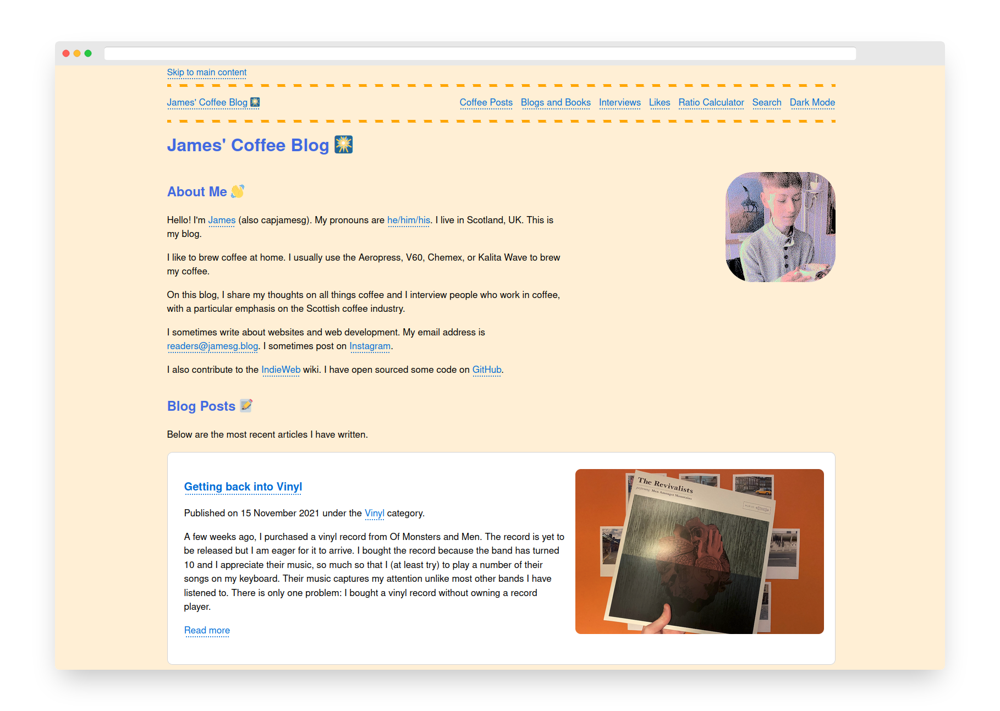

# letsjam

letsjam is a static site generator built with Python and jinja2.

letsjam is the generator behind my personal website, [jamesg.blog](https://jamesg.blog).

*This project is under active construction. There may be bugs present that are yet to be fixed.*

## Features

letsjam can:

- Build static pages from jinja2 templates.
- Create date archive pages formatted as /YYYY/MM/DD/
- Create paginated pages for each category you use on your blog (i.e. /category/coffee/2/)
- Create pages for groups of posts

## An Example File

A letsjam file should consist of either plain HTML or front matter followed by HTML or markdown.

Here is an example file that you could use in your generator:

    ---
    layout: default
    title: Social
    description: Links to all of the social posts on this website.
    ---

    <h1>Likes ❤️</h1>

    
Likes are posts where I share web pages I have liked reading or looking at.

This will create a file using the "default" layout.

Any item in the front matter will be available in the template as a variable, accessible through .page.

This syntax is designed to be similar to Jekyll, a popular static site generator. This is because all of my templates were written in Jekyll and I wanted to preserve the variable and formatting structure.

### jinja2 and Jekyll Front Matter Distinction

Please note this project is not compatible with every Jekyll file. You will need to use jinja2 markup rather than Liquid markup if you want to introduce logic to yuor pages. While both syntaxes share some features, a large portion of Liquid syntax (i.e. date formatting, string manipulation) and Jekyll syntax (i.e. limits and reverse sorting) is not supported natively by jinja2.

## Setup

First, install the required dependencies for this project:

    pip3 install -r requirements.txt

Once you have installed the required dependencies, you can run the project.

Place all of the files you want to include in your site in the same folder as your app.py file.

If you have static assets, make sure they are placed in a folder called "assets".

If you have blog posts, please move them to a folder called _posts.

To run the static site generator, use this command:

    python3 app.py

All files generated are placed in a _site directory. This directory is purged on each generation.

### letsjam Server

During development, you may want to host the site locally on a server so you can easily explore your site.

This project comes with a barebones Flask server that you can use for development. You can use the server by running this command:

    python3 server.py

The server is not built for production use. Please do not use the server in production.

## My Site

My blog, jamesg.blog, runs on letsjam. Here is a screenshot of my site home page, generated with letsjam:

## Technologies Used

- Python 3
- Jinja2

## Licence

This project is licensed under the [MIT License](LICENSE)

## Contributors

- capjamesg